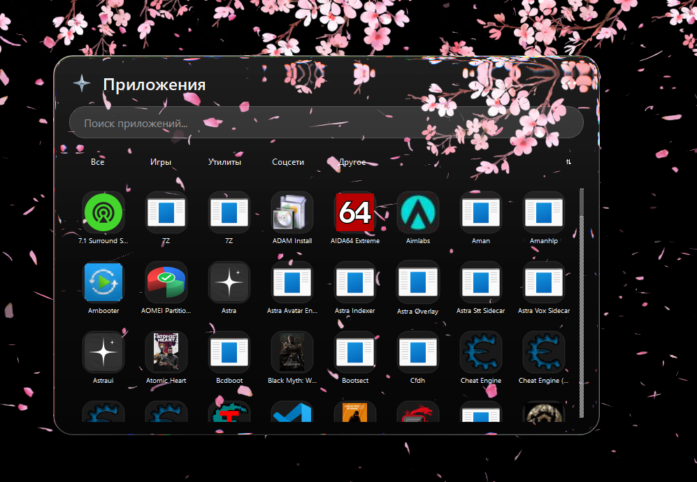
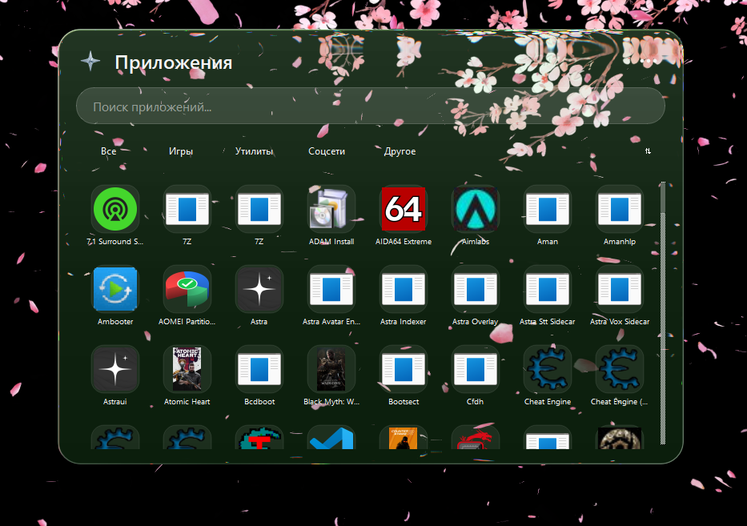
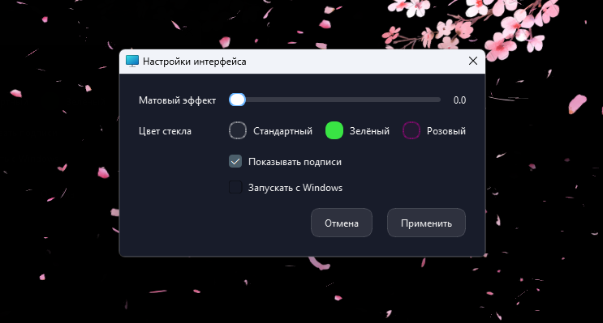

# MOON Launchpad 🌙

Modern application launcher for Windows built with Python and PySide6.

MOON is a desktop Launchpad designed to provide fast access to installed applications through a modern glassmorphism interface.

## 📸 Screenshots

### Main interface



### Application search



### Settings



## ✨ Features

- 🔎 Fast application search
- 🚀 Quick application launching
- 📂 Automatic application scanning
- 🗂 Application categories
- ⇅ Multiple sorting modes
- 🎨 Customizable interface
- 🪟 Glassmorphism interface
- 🌫 Background blur and refraction effects
- 🖱 Custom animated UI components
- ⌨ Global hotkey support
- ⚙ Interface settings
- 🚀 Launch with Windows
- 🌓 Theme support

## 🛠 Technologies

- Python 3
- PySide6
- Qt6
- NumPy
- Windows API
- PyWin32
- Custom PyGlass integration

## 📁 Project structure

```text
Launchpad/
├── animations/
│   └── animator.py
├── assets/
│   └── icons/
├── models/
│   └── app_model.py
├── pyglass_pyside/
│   ├── backdrop.py
│   ├── blur.py
│   ├── effect.py
│   ├── glass.py
│   ├── pane.py
│   └── refract.py
├── styles/
│   └── style.qss
├── ui/
│   ├── app_card.py
│   ├── dock.py
│   ├── launchpad.py
│   ├── popover_menu.py
│   ├── search.py
│   └── settings_dialog.py
├── utils/
│   ├── app_scanner.py
│   ├── backdrop.py
│   ├── global_hotkey.py
│   ├── icon_cache.py
│   ├── settings_store.py
│   ├── startup.py
│   └── theme.py
├── widgets/
│   ├── animated_label.py
│   ├── hover_button.py
│   ├── liquid_glass.py
│   └── ...
└── main.py